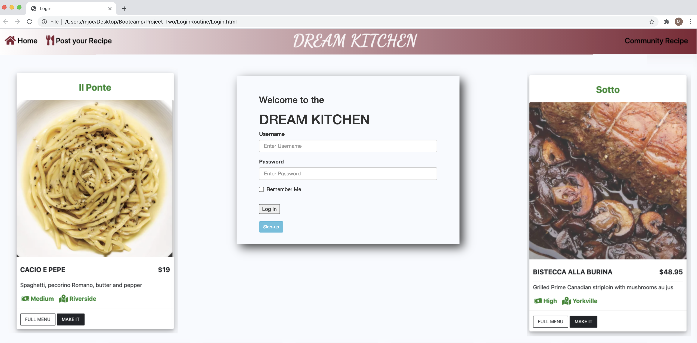
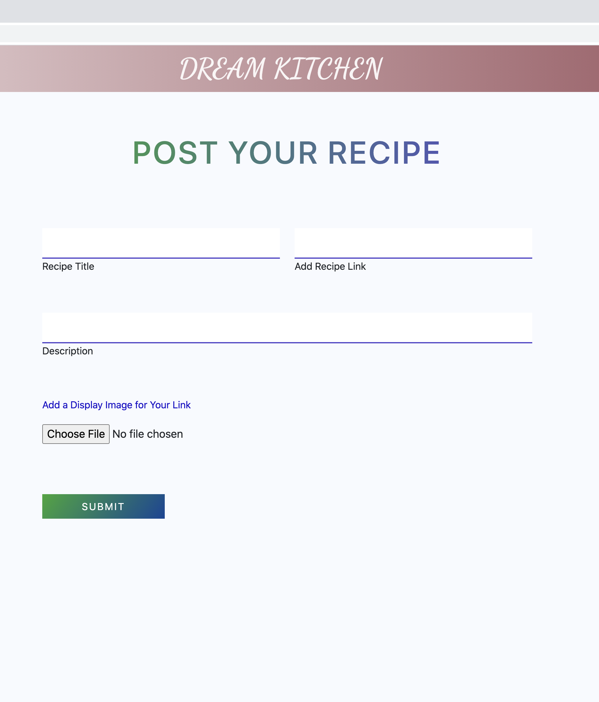

# Assignment15

This is the repo for Legendary Twisters - Project Two due March 5, 2021.

# Unit 15: Project Two

Submitted: March 8, 2021
            Shiva Sabokdast, Lead Developer and back end
            Ben Elliott, HTML Integrator and Search Wizard
            Hilary, Testing
            Michael O'Connor, WebDev Wannabe, Database Management, Heroku Deployment and Documentation

   * [01 Goal:](#01-goal)
   * [02 Approach:](#02-approach)
   * [03 Presentation Requirements](#03-presentation-requirements)
   * [04 Testing and Quality Control:](#04-testing-and-quality-control)
   * [05 Lessons Learned:](#05-lessons-learned)
   * [06 Further Developments:](#06-further-developments)
   * [07 Current Renderings:](#07-current-renderings)
   * [08 Installation Instructions](#08-installation-instructions)
   * [09 Usage Info](#09-usage-info)
   * [10 Contribution Guidelines](#10-contribution-guidelines)
   * [11 Licence](#11-licence)
   * [12 Questions](#12-questions)

# 01 Goal: 

    The goal of the project is to design and build a full-stack web application using the MVC paradigm, our own server-side API, add user authentication, and connect to a database. Here is a link to the Github folder https://github.com/benelliott111/Restaurant-Search, a link to the project's Kan-Ban https://github.com/benelliott111?tab=projects and a link to the deployed website  https://dreamkitchentoronto.herokuapp.com/.

# 02 Approach:

    In approching this project, our team met to discuss various options for a Minimum Viable product.  After discussion we settled on a website that would bridge the gap between restaurants and recipes, seeding our own website with a number of restaurants, menus and links to recipes on the internet that closely resemble the dishes served at the restaurant. The details are maintained in a databse and users may also add their own dishes to a database to contibute to the community of recipes.  The real world problem the webiste resolves is finding somewhere that makes a recipe for those who do not cook and finding a recipe for a restaurant menu item that someone who can cook wished to try.

    We understood that there were certain immutable user requirements: 
            
            [X] Must be full-stack: front-end + RESTful API calls + backend + database
            [X] Use Node+Express
            [X] MySQL database, with the actual SQL statements in a separate module with method calls (ORM)
            [X] RESTful API calls: GET, POST, DELETE, PUT that send JSON data
            [X] Must utilize at least ONE new library, package, or technology that we haven’t discussed
            [X] Must have a polished frontend / UI (bootstrap 5 + mobile first)
            [X] Must meet good quality coding standards (indentation, scoping, naming), using LINTING
            [X] Must not expose sensitive API key information on the server (use npm package dotenv)
            [X] Structured at least loosely MVC:
                /project2
                /public (all the html, the ‘view’ component)
                /public/assets (all the images, css, js)
                /app (all the server-side logic)
                /app/orm.js (the ‘model’ component)
                /app/routes (for the routing logic, or ‘controller’ component) server.js
            [X] deployed using Heroku (with mysql database)

    We allocated the work to those who best could deliver on elements of the project and discussed a roadmap for the project over the ensuing week for substailal completion on  Friday March 5 to allow for final adjustments and user acceptance over the weekend. Team members stepped up for development of aspects that they believed they could deliver.  We used the KANBAN model for managing the project and met on daily during the class time to advance the project. SEE THE KANBAN https://github.com/benelliott111?tab=projects to follow the flow of the work effort. At all times we had the scope limitations and timelines in mind to ensire success.  On the Friday before delivery, we had the final working prototype up and running and had completed most of the testing to ensure functionality.  Still, additional user acceptance testing would be done over the weekend.  We were able to maintain a flow of github pulls and merges by managing changes in each team members separate branches and periodically reconiling changes on merging.

# 03 Presentation Requirements

The presentation on Monday February 8, 2021 addresses the following: 

            [x] Elevator pitch:  Our app builds a bridge between recipes and restaurants.

            [x] Concept: We wanted to create a database of restaurant menu items and provide curated links to recipes one could make at home and vice versa.

            [x] Process: We created a database in MySQL and deployed it through Heroku.com, using Handlebars, Node, Express and Sequelize to support it all.

            [x] Demo: We will demo it live.

            [x] Directions for Future Development are described below.

            [x] Links to the deployed application and the GitHub repository, see above.

# 04 Testing and Quality Control:

    Testing included (see Testing Routine ):

        [x] Agile Component Testing - MySQL Database, first by developer and then by independent team member;
        [x] Agile Component Testing - Heroku COnnection, first by developer and then by independent team member;
        [x] Integrated Testing, down by all team members on the fly as integration was underway, then on weekend;
        [x] Regression testing of key functionality once final changes made;
        [x] User Acceptance testing.

# 05 Lessons Learned:

The following topics were applied during the project:

    * Full-stack applications

    * Git branching workflow

    * Agile software development

    * Collaborative development

# 06 Further Developments:

    1. Social Media Links.

    2. Ability to share cards.

    3. Ability to send links to specific recipes or menus.

    4. Searching based on full dish description.

    5. Appropriate Login page to allow for only authorized user entries.

# 07 Current Renderings:

 Not Implemented

# 08 Installation Instructions 

Be sure to do an npm install and install mySQL, Handlebars, Node, Express and Sequelize.

# 09 Usage Info 

Feel free to try the app here https://dreamkitchentoronto.herokuapp.com/.

# 10 Contribution Guidelines 

We do not expect to develop this any further.

# 11 Licence 

 MIT

# 12 Questions 

If there are any questions please contact any member of the team. 
